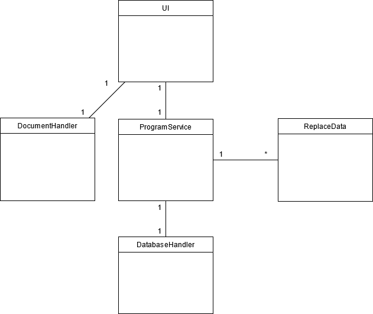

# Arkkitehtuuri

## Rakenne

Pakkaus ui sisältää käyttöliittymän, services sovelluslogiikan ja repositories tietokantatallennuksen koodin. Entities sisältää luokan ReplaceData, joka kuvastaa yhtä täyttötietoa yhdessä asiakirjapohjassa.

## Luokkakaavio

UI-luokka huolehtii käyttöliittymän logiikasta ja ProgramService suurimmasta osasta sovelluslogiikkaa. ProgramService-luokka välittää tietoja luokkien välillä ja tarjoaa kaikille käyttöliittymän toiminnoille metodin.

ReplaceData-olioon tallennetaan asiakirjapohjan täytössä tarvittavat tiedot. Näitä ovat asiakirjapohjan nimi, mitä tietoa käyttäjän halutaan syöttävän ja tämän tiedon paikkamerkki asiakirjapohjassa.

DocumentHandler-luokka huolehtii korvaavan sanan kirjoittamisesta .docx-muotoisesta asiakirjapohjasta löytyvän paikkatiedon paikalle sekä asiakirjan lukemisesta ja tallentamisesta.
Asiakirjapohjat löytyvät ohjelman juuresta kansiosta "asiakirjapohjat", ja valmiit asiakirjat tallennetaan "valmiit asiakirjat"-kansioon.

DatabaseHandler-luokka vastaa tiedon pysyväistalennetamisesta tietokantaan ja tietokannasta hakemisesta.

## Tiedostot

Ohjelman juuresta löytyvät kansiot asiakirjapohjat, data, dokumentaatio, src ja valmiit asiakirjat.

Asiakirjapohjat-kansioon laitetaan käyttäjän muokkaamat asiakirjapohjat paikkamerkintöineen .docx-muodossa.

Data-kansiosta löytyy ohjelman tietokanta.

Dokumentaatio-kansiossa on ohjelman dokumentaatio.

Src-kansiosta löytyy ohjelmakoodi.

Valmiit asiakirjat -kansioon tallentuvat valmiit täytetyt asiakirjat .docx-muodossa.

