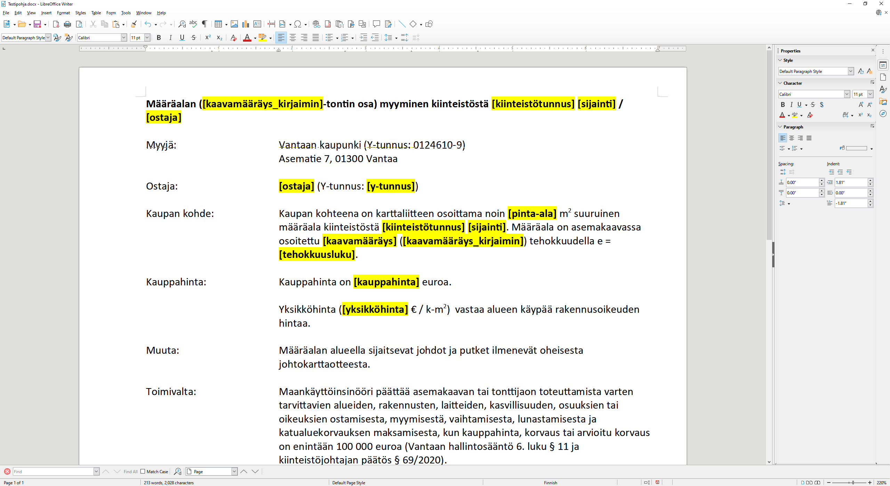
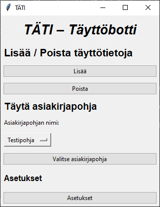
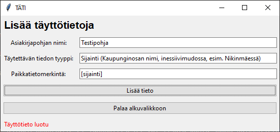
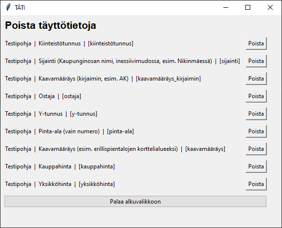
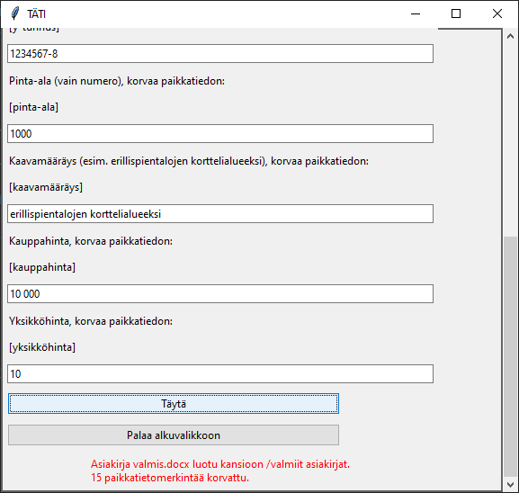
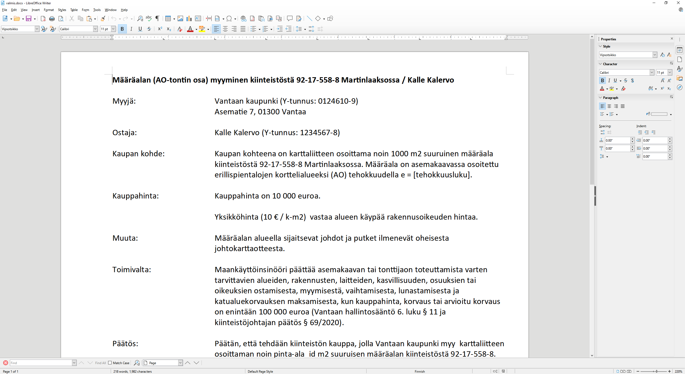

# TÄTI – Käyttöohje

## Ohjelman käynnistäminen

Asenna tarvittavat riippuvuudet poetryn kautta komennolla:

*poetry install*

Suorita sovellus komennolla:

*poetry run invoke start*

Windows-ympäristössä käytä komentoa:

*poetry run invoke start-windows*

## Asiakirjapohjat

1. Ennen sovelluksen käyttöä muokkaa asiakirjapohja haluamaksesi. Automatisoitua täyttöä tarvitsevaan kohtaan laita paikkatietomerkintä. Jos esimerkiksi haluat kiinteistötunnuksen 92-17-558-8 täytettynä useaan kohtaan asiakirjassa, voit käyttää paikkatietomerkintänä esim. [kiinteistötunnus] -merkintää niissä kohdissa, joihin haluat tiedon täydentyvän. Paikkatietomerkintä voit käyttää mitä merkintää haluat, mutta suositeltua on käyttää hakasulkuja paikkatietomerkissä, jotta paikkatietomerkintä ei sekoitu muihin sanoihin.

2. Tallenna asiakirjapohja .docx-muodossa ohjelman juureen kansioon "asiakirjapohjat". HUOM! Vain .docx-muotoiset asiakirjat toimivat.

Ohjelmassa käytettävän kirjaston heikkouksista johtuen tietyn kappaleen sisällä olevat muutokset poistuvat. Esim. jos yksi sana keskellä kappaletta on lihavoituna, poistuu lihavointi. Lisäksi asiakirjapohjia täytettäessä asiakirjapohjan fontti ja fonttikoko muuttuvat käyttämään ohjelman fonttia ja fonttikokoa. Asiakirjapohjat kannattaa tehdä käyttäen yhtä fonttia ja fonttikokoa.

## Ohjelman käyttö

### Alkuvalikko

Alkuvalikosta pääset Lisää täyttötietoja -näkymään painamalla nappia "Lisää", Poista täyttötietoja -näkymään painamalla "Poista"  ja asiakirjapohjien täyttämiseen valitsemalla asiakirjapohjan nimen valikosta ja painamalla nappia "Valitse asiakirjapohja". Sinun on lisättävä täyttötietoja sovelukseen ennen kuin pystyt täyttämään asiakirjapohjia.

Asetuksista voit vaihtaa fontin ja fonttikoon. Aina kun ohjelma käynnistetään, vaihtuu fontiksi oletusfontti Calibri ja fonttikooksi oletuskoko 11.

### Lisää täyttötietoja -näkymä

Tässä näkymässä voit lisätä täyttötietoja järjestelmään. Täyttötietojen pohjalta ohjelma täyttää halutut asiakirjapohjat.

1. Asiakirjapohjan nimeen täytä haluamasi asiakirjapohjan nimi ilman .docx-päätettä. HUOM! Nimen on oltava täsmälleen samassa muodossa kuin se on asiakirjapohjat-kansiossa.

2. Täytettävän tiedon tyyppiin täytä halutun tiedon tyyppi. Tähän kohtaan voi kirjoittaa myös ohjeita käyttäjille. Esim. jos paikkatieto koskee sijaintia, voit täyttää kohtaan esim. "Sijainti (Kaupunginosan nimi, inessiivimudossa, esim. Nikinmäessä)".

3. Paikkatietomerkintään täytä paikkatietomerkintä siinä muodossa kuin se on lisättynä asiakirjapohjaan. Esimerkkinä [sijainti]. HUOM! Paikkatietomerkinnän on oltava täsmälleen samassa muodossa kuin se löytyy asiakirjapohjasta.

4. Paina "Lisää tieto" -nappia, kun haluat lisätä täyttötiedon järjestelmään. 

Järjestelmään voi lisätä useita asiakirjapohjia ja niille useita täyttötietoja. Samalle asiakirjapohjalle ei luonnollisesti voi lisätä kahta samaa paikkatietomerkintää.

### Poista täyttötietoja -näkymä

Tässä näkymässä voit poistaa tarpeettomat tai vahingossa lisätyt täyttötiedot järjestelmästä yksi täyttötieto kerrallaan.

### Täytä asiakirjapohja-näkymä

Tässä näkymässä voit täyttää järjestelmään lisätyn asiakirjapohjan täyttötiedoilla, jotka on lisätty valitulle asiakirjapohjalle.

1. Täytä kaikki asiakirjapohjaa koskevat kohdat. Esimerkiksi edellä mainittuun kiinteistötunnusesimerkkiin syötä 92-17-558-8.

2. Paina "Täytä"-nappia ja ohjelma täyttää asiakirjapohjan paikkatietomerkinnällä varustetut kohdat syötetyllä tiedolla. Valmis asiakirja tallentuu "valmiit asiakirjat" -kansioon nimellä valmis.docx.

3. Täytettyä valmista asiakirjaa voi tietenkin vielä muokata tekstinkäsittelyohjelmalla.

