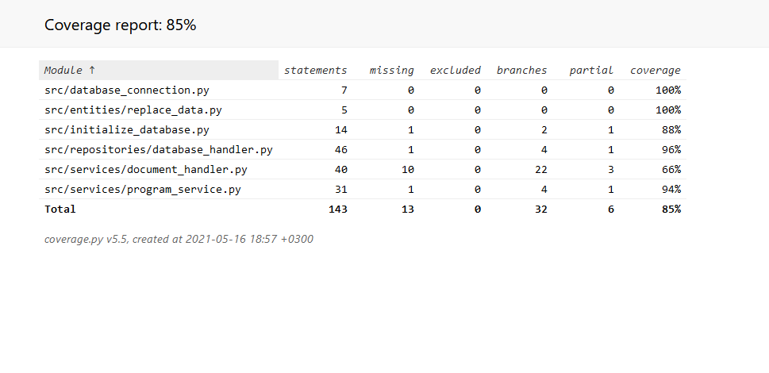

# Testausdokumentti

Ohjelmaa on testattu sekä automatisoiduin testein unittestilla sekä manuaalisesti järjestelmätason testeillä. Kaikkia määrittelydokumentin toiminnallisuuksia on testattu.

## Yksikkö- ja integraatiotestaus

### Sovelluslogiikka

Sovelluslogiikasta vastaavaa ProgramService-luokkaa testataan TestProgramService-testiluokalla. 

### Tietokanta

Tietokantaluokkaa DatabaseHandler testataan ProgramService-luokan metodien kautta, koska kaikki operaatiot toimivat ProgramService-luokan kautta.

### Testauskattavuus

Sovelluksen testauksen haarautumakattavuus on 85%. Käyttöliittymäluokat on jätetty testauksen ulkopuolelle.

## Järjestelmätestaus

Sovelluksen järjestelmätestaus on suoritettu manuaalisesti.

## Ongelmat

Ohjelma täyttää sille asetetut vaatimukset melko hyvin. Koodin luettavuudessa ja testeissä olisi osin parannettavaa. 

Testeihin ei ole tehty testitietokantaa ja testaus tyhjentää tuotantotietokannan.

Ohjelmassa käytettävän kirjaston heikkouksista johtuen tietyn kappaleen sisällä olevat muutokset poistuvat. Koitin erilaisia menetelmiä tämän ongelman poistamiseen, mutta en onnistunut löytämään täysin toimivaa ratkaisua ongelmaan. Nykyinen implementaatio on yrityksistäni paras vaihtoehto. Nyt esimerkiksi jos yksi sana keskellä kappaletta on lihavoituna, poistuu lihavointi. Lisäksi asiakirjapohjia täytettäessä asiakirjapohjan fontti ja fonttikoko muuttuvat käyttämään ohjelman fonttia ja fonttikokoa.

Täytä asiakirjapohja -toiminnallisuus hyväksyy tyhjät kentät, mutta tämä on tarkoituksellista, sillä joskus jokin kenttä saatetaan haluta jättää tyhjäksi.